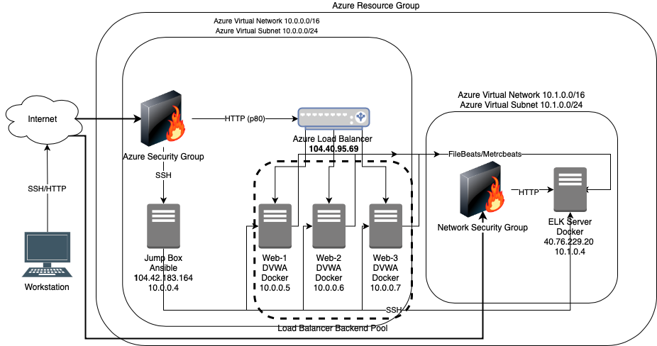
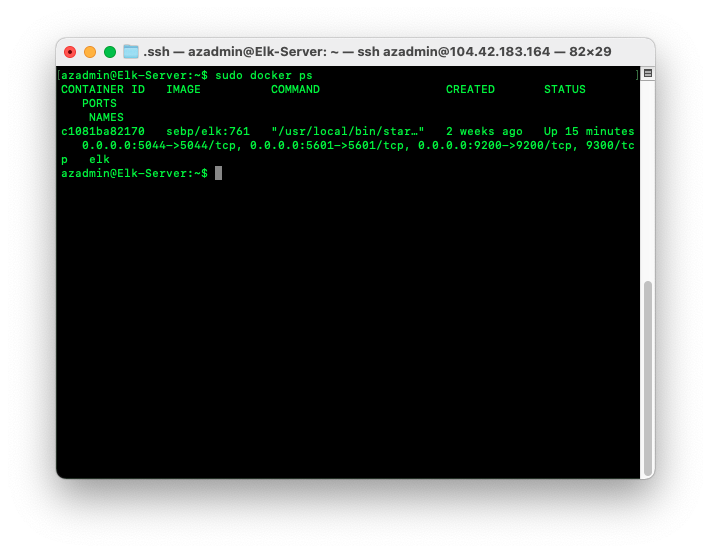

## Automated ELK Stack Deployment

The files in this repository were used to configure the network depicted below.



These files have been tested and used to generate a live ELK deployment on Azure. They can be used to either recreate the entire deployment pictured above or the individual files may be used to install only certain pieces of it, such as Filebeat.

[Ansible Playbooks](Playbooks/)

This document contains the following details:
- Description of the Topology
- Access Policies
- ELK Configuration
  - Beats in Use
  - Machines Being Monitored
- How to Use the Ansible Build


### Description of the Topology

The main purpose of this network is to expose a load-balanced and monitored instance of DVWA, the D*mn Vulnerable Web Application.

Load balancing ensures that the application will be highly available, in addition to restricting access to the network since only the load balancer is exposed to traffic outside from outside of the local network.   

To facilitate maintenance and administration tasks a jump box has been included the design.   The jump box allows SSH access from specific outside IP addresses only.  Once access has been gained to the jump box, the web severs may be accessed via an SSH connection from the Ansible Docker container.

Integrating an ELK server allows users to easily monitor the vulnerable VMs for changes to the web traffic using Metricbeat and system logs using Filebeat.

The configuration details of each machine may be found below.

| Name       | Function | IP Address              | Operating System |
|------------|----------|-------------------------|------------------|
| Jump Box   | Gateway  | 10.0.0.4/104.42.183.164 | Linux            |
| Web-1      | Server   | 10.0.0.5                | Linux            |
| Web-2      | Server   | 10.0.0.6                | Linux            |
| Web-3      | Server   | 10.0.0.7                | Linux            |
| ELK Server | Server   | 10.1.0.4/40.76.229.20   | Linux            |

### Access Policies

The machines on the internal network are not exposed to the public Internet.

Only the jump box machine can accept connections from the Internet. Access to this machine is only allowed from the following IP address: 72.208.179.62

Machines within the network can only be accessed via SSH.

The ELK stack server can only be accessed from the internet by IP address 72.208.179.62 on port 5601.

A summary of the access policies in place can be found in the table below.

| Name        | Publicly Accessable | Allowed IP Adresses |
|-------------|---------------------|---------------------|
| Jump Box    | Yes                 | 72.208.179.62       |
| Web-1       | No                  | 10.0.0.4            |
| Web-2       | No                  | 10.0.0.4            |  
| Web-3       | No                  | 10.0.0.4            |  
| ELK Server  | Yes                 | 72.208.179.62       |

### Elk Configuration

Ansible was used to automate configuration of the ELK machine. No configuration was performed manually, which is advantageous because it allows for rapid deployment.

The playbook implements the following tasks:
- Memory configuration
- Download and Install of Docker.io
- Download and Install Python3 and Pip
- Download and Launch the ELK container
- Enable the ELK service

The following screenshot displays the result of running `docker ps` after successfully configuring the ELK instance.



### Target Machines & Beats
This ELK server is configured to monitor the following machines:

| Name  | IP Address |
|-------|------------|
| Web-1 | 10.0.0.5   |
| Web-2 | 10.0.0.6   |
| Web-3 | 10.0.0.7   |

We have installed the following Beats on these machines:
- Filebeats
- Metricbeats

These Beats allow us to collect the following information from each machine:
- Filebeats - Gathers Linux system log file data. Useful for detecting suspicious or unauthorized logins to the system and if any suspicious sudo activity has taken place.

- Metricbeats - Gathers data that pertains to traffic patterns into the web servers.   This is useful to determine if suspicious activity is coming from a specific region and for determining if suspicious activity is being performed at a certain time of day.

### Using the Playbook
In order to use the playbook, you will need to have an Ansible control node already configured. Assuming you have such a control node provisioned:

SSH into the control node and follow the steps below:
- Copy the install_elk.yml, install_filebeat.yml, and install_metricbeat.yml files to the /etc/ansible directory of the Ansible container located on the the Jump Box.

- Update the /etc/ansible/hosts file to include specifications for both the webservers and the ELK server which contain the following:
```
[webservers]
10.0.0.5 ansible_python_interpreter=/usr/bin/python3
10.0.0.6 ansible_python_interpreter=/usr/bin/python3
10.0.0.7 ansible_python_interpreter=/usr/bin/python3

[elk]
10.1.0.4 ansible_python_interpreter=/usr/bin/python3
```
- Run the playbook, and navigate to 40.76.229.20 to check that the installation worked as expected.
